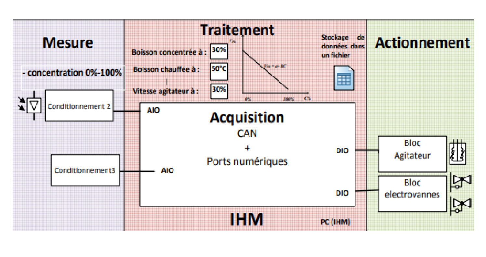
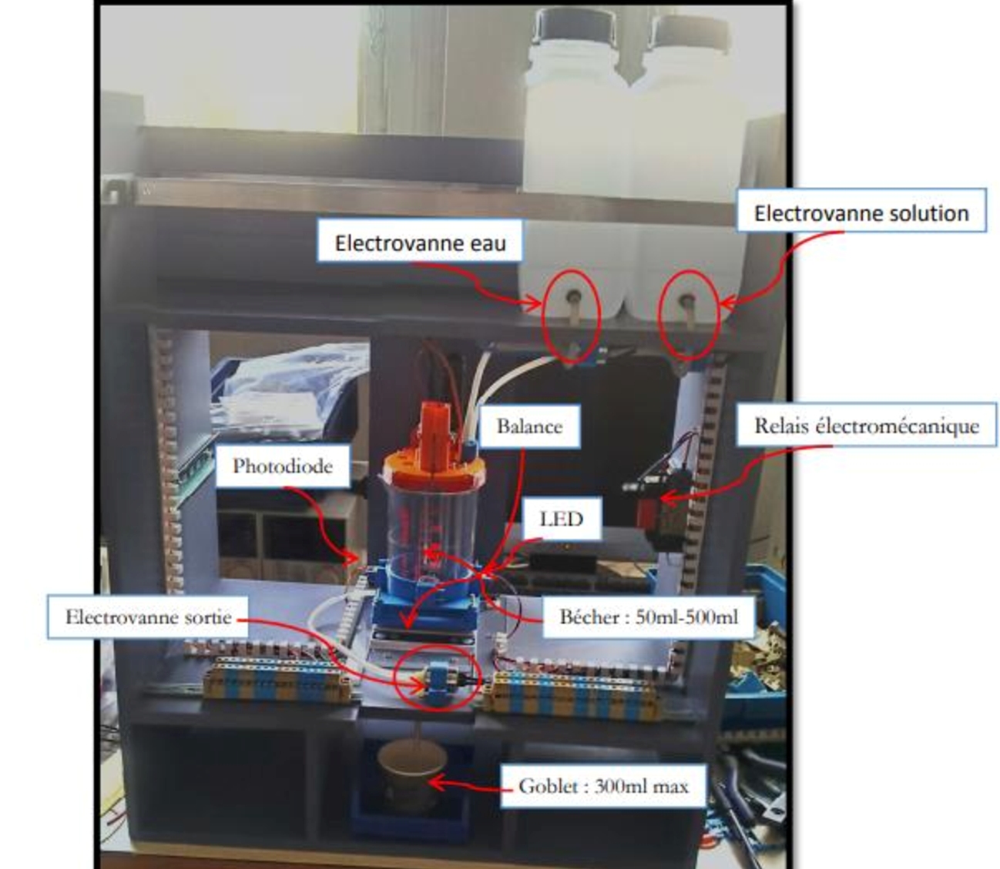

# Robot doseur
Configuration électronique des régulateurs et des étages d’amplification nécessaires au bon fonctionnement du robot, en utilisant des simulations avec LabVIEW et LTspice. L’objectif final est de concevoir un robot capable de fournir une boisson avec une concentration, une température et un volume spécifiques, choisis à l’avance.

# Objectif

Il s’agit de développer les parties matérielle et logicielle (IHM) d’un robot doseur, qui devra respecter le cahier des charges suivant :
- Boissons tièdes ou chaudes, avec une température allant de : 20°C à 50°C,
- Boissons de différentes concentrations allant de : 10% à 90%,
- Boissons de différents volumes allant de : 50ml à 250ml (dans le gobelet).

On va compter 3 grandes parties dans ce projet qu'on peut voir dans le schéma suivant :

On dispose de notre maquette qu'on peut voir ci dessous :

